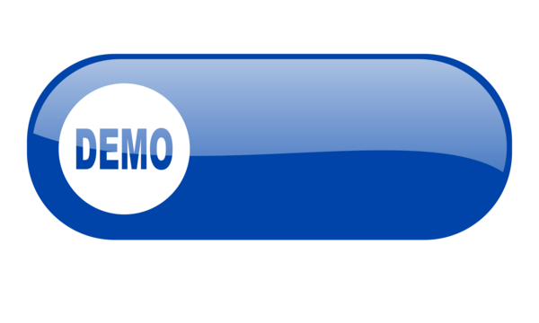
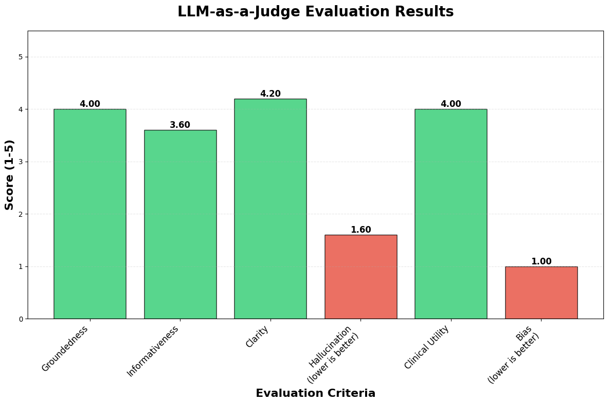
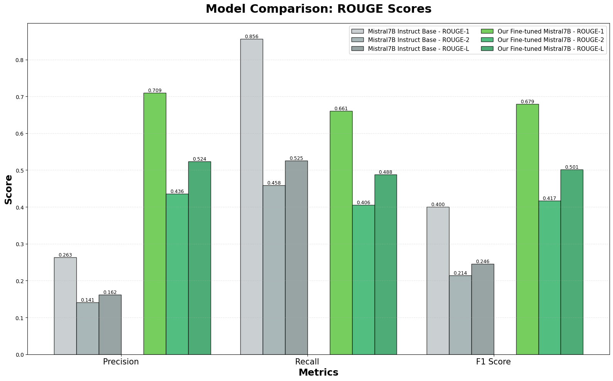

# MedConnect AI - Remote Medical Assistant

**A Multi-Agent AI System for Intelligent Patient Triage, Medical History Collection, and Doctor Matching**


<p align="center">
  <a href="https://medconnect-ai.streamlit.app/">
    
  </a>
</p>

MedConnect AI is a sophisticated, production-ready multi-agent medical assistant built with **LangGraph**, powered by **Gemini Flash** and a **fine-tuned medical LLM** (Mistral-7B). It acts as an intelligent virtual receptionist that guides patients through their medical concerns, collects structured clinical history, generates professional SOAP notes, and matches them with verified doctors based on preferences and clinical needs.

Designed for integration into medical freelance platforms like MedConnect, this system supports **voice and text input**, **multilingual communication** (English, Hausa, Yoruba, Igbo), and **premium-tier enhanced capabilities**.

---

## Features

- **Intelligent Routing**: Receptionist → General Medical Q&A → Clinical Clerking → SOAP Generation → Doctor Matching
- **Multi-Language Support**: English, Hausa, Yoruba, Igbo with real-time translation (Google Translate) and localized TTS voices
- **Voice Interaction**: Speech-to-Text and Text-to-Speech via Spitch (audio input/output supported)
- **Professional Medical Documentation**: Automated SOAP note generation using fine-tuned medical LLM
- **Smart Doctor Matching**: Filters by specialty, location, fee, experience, gender, language, availability, and urgency
- **Premium vs Free Tier Logic**: Enhanced routing and access to specialized medical LLM for premium users
- **Robust State Management**: LangGraph-powered stateful conversations with proper handoffs
- **FastAPI Backend**: Clean, documented REST API with health checks and session support

---

## System Architecture


---

## Tech Stack

- **Framework**: LangGraph (StateGraph) + LangChain
- **Primary LLM**: Google Gemini 2.5 Flash Lite (`gemini-2.5-flash-lite`)
- **Medical LLM**: Fine-tuned Mistral-7B (`Agaba-Embedded4/MedConnectAI_Merged`) hosted on RunPod
- **Translation**: Google Cloud Translation API
- **Speech**: Spitch (STT & TTS) with native African language voices
- **API**: FastAPI (with Pydantic models)
- **Deployment Ready**: Environment-driven configuration

---

## Supported Languages & Voices

| Language | Code   | TTS Voice  |
|----------|--------|------------|
| English  | en     | comfort    |
| Hausa    | ha     | zainab     |
| Yoruba   | yo     | sade       |
| Igbo     | ig     | amara      |

---

## Getting Started

### 1. Clone the Repository
```bash
git clone https://github.com/AgabaEmbedded/MedConnect-AI.git
cd MedConnect-AI
```

### 2. Set Up Virtual Environment
```bash
python -m venv venv
source venv/bin/activate    # On Windows: venv\Scripts\activate
```

### 3. Install Dependencies
```bash
pip install -r requirements.txt
```

### 4. Environment Variables

Create a `.env` file in the root directory:

```env
GEMINI_API_KEY=your_gemini_api_key_here
GOOGLE_PROJECT_ID=your_google_cloud_project_id
RUNPOD_BASE_URL=https://your-runpod-endpoint.proxy.runpod.net/v1
# Optional: Override doctor API endpoint
# USERS_ENDPOINT=https://medconnect-api-xrmi.onrender.com/api/agents
```

> **Note**: The system currently uses `dummy_doctors` from `doclist.py` for testing. Replace with real API fetch in production.

### 5. Run the Server
```bash
uvicorn main:app --reload
```

Server will be available at: `http://127.0.0.1:8000`

---

## API Endpoints

### `POST /conversation`
Main endpoint for user interaction.

**Request Body**:
```json
{
  "message": "I've been having chest pain for two days",
  "audio": "base64_encoded_audio_string",  // optional
  "premium": false,
  "language": "english"  // or "hausa", "yoruba", "igbo"
}
```

**Response**:
```json
{
  "message": "I'm sorry to hear that. Can you describe the pain?",
  "audio": "base64_encoded_response_audio",  // if input was audio
  "doctorid": "doc_123",                     // only on final handoff
  "medical_summary": "S: Chest pain x2 days..." // SOAP note on completion
}
```

### `GET /health`
Health check endpoint.

### `POST /reset`
Reset conversation state (useful for testing).

### `GET /translation` *(Utility)*
Translate text between supported languages.

---

## Model Links & Training

- Continual Pretraining Notebook:  
  https://www.kaggle.com/code/sundayabraham/medconnect-continual-pre-training-mistral

- Instruct Fine-Tuning Notebook:  
  https://www.kaggle.com/code/burnfroster/instruct-tunning-medconnect

- Model Evaluation Notebook:  
  https://www.kaggle.com/code/sundayabraham/evaluating-medconnectai

### Evaluation Results

**LLM-as-a-Judge Evaluation**  


**ROUGE Score Comparison**  


---

## Future Improvements

- Persistent session management (Redis/database)
- Real-time doctor availability sync
- Integration with payment gateway for consultations
- Video consultation handoff
- Patient follow-up automation
- Expanded language support

---

## Contributing

Contributions are welcome! Please feel free to submit issues, fork the repo, and send pull requests.

1. Fork the project
2. Create your feature branch (`git checkout -b feature/amazing-feature`)
3. Commit your changes (`git commit -m 'Add amazing feature'`)
4. Push to the branch (`git push origin feature/amazing-feature`)
5. Open a Pull Request

---

## License

This project is proprietary and developed for **MedConnect**. All rights reserved.

---

**Built with ❤️ for accessible healthcare in Africa**  
By [Agaba Embedded](https://github.com/AgabaEmbedded)
``` 
